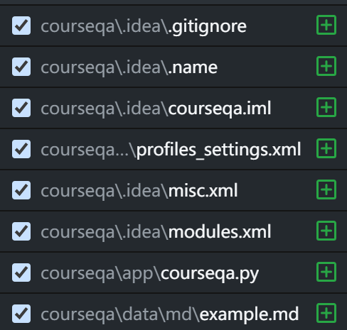

# Course-Design-of-Human-Computer-Interaction-Software
A CourseQA system base on Python. The update cycle will continue to 2026.05 until the course is finished

Week 1 Task:  (2025-3-8)
Complete the environment setup and implement the reading of markdown files.
Environment: Pycharm-2025.3.2.1  Python-3.13

